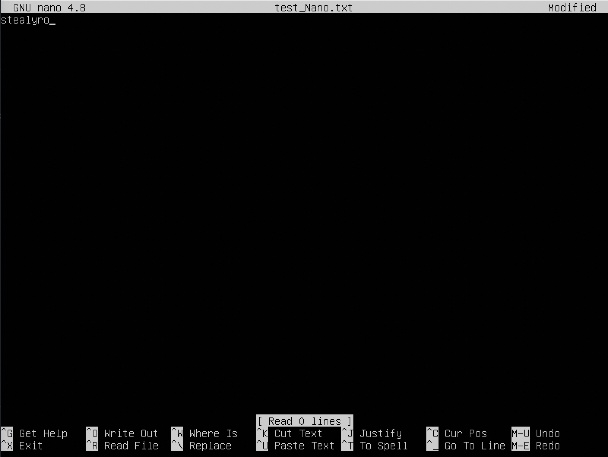
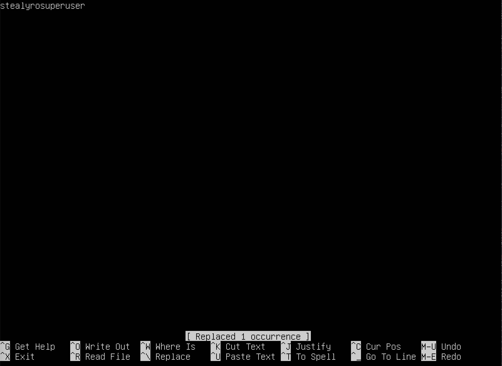

## Part 1. Установка ОС

##### Установить **Ubuntu 20.04 Server LTS** без графического интерфейса. (Используем программу для виртуализации - VirtualBox)

 `- cat /etc/issue.`

## Part 2. Создание пользователя

`- sudo usermod`

##### Создать пользователя, отличного от пользователя, который создавался при установке. Пользователь должен быть добавлен в группу `adm`.
 `- getent group adm`

 `- cat /etc/passwd`

 

## Part 3. Настройка сети ОС

##### Задать название машины вида user-1 

 `- sudo vim /etc/hostname`

##### Установить временную зону, соответствующую вашему текущему местоположению.  
 `- sudo timedatectl set-timezone Europe/Moscow`

##### Вывести названия сетевых интерфейсов с помощью консольной команды.

`- ip addr show`

	lo (loopback device) – виртуальный интерфейс, присутствующий по умолчанию в любом Linux. Он используется для отладки сетевых программ и запуска серверных приложений на локальной машине. С этим интерфейсом всегда связан адрес 127.0.0.1. У него есть dns-имя – localhost.

##### Используя консольную команду получить ip адрес устройства, на котором вы работаете, от DHCP сервера. 

`- hostname -I` 

	Протокол DHCP — это протокол клиента или сервера, который автоматически предоставляет узел протокола IP с его IP-адресом и другие связанные сведения о конфигурации, такие как маска подсети и шлюз по умолчанию.

##### Определить и вывести на экран внешний ip-адрес шлюза (ip) и внутренний IP-адрес шлюза, он же ip-адрес по умолчанию (gw). 

`- curl http://ipecho.net/plain`
	
	Внешний ip адрес шлюза

` - ip route`

	Внутренний ip адрес шлюза

##### Определить и вывести на экран внешний ip-адрес шлюза (ip) и внутренний IP-адрес шлюза, он же ip-адрес по умолчанию (gw). 
##### Задать статичные (заданные вручную, а не полученные от DHCP сервера) настройки ip, gw, dns (использовать публичный DNS серверы, например 1.1.1.1 или 8.8.8.8). 

` - ip route`

`- sudo vim /etc/netplan/*.yaml`

`- ping 1.1.1.1`

`- ping 8.8.8.8`

##### Перезагрузить виртуальную машину. Убедиться, что статичные сетевые настройки (ip, gw, dns) соответствуют заданным в предыдущем пункте. 

`- reboot`

## Part 4. Обновление ОС

##### Обновить системные пакеты до последней на момент выполнения задания версии.  

`- sudo apt-get update`

`- sudo apt-get upgrade`

## Part 5. Использование команды **sudo**

##### Разрешить пользователю, созданному в [Part 2](#part-2-создание-пользователя), выполнять команду sudo.

	sudo - это важная для понимания утилита, она позволяет временно поднимать привилегии и выполнять задачи администрирования системы. Суть в том, что в каждом дистрибутиве Linux есть пользователь root, имеющий максимальные права .

`-sudo adduser %username sudo`

	Для проверки используем:

`-sudo -l -U ubuntuserver`

## Part 6. Установка и настройка службы времени

##### Настроить службу автоматической синхронизации времени. 

`-timedatectl show`

## Part 7. Установка и использование текстовых редакторов 

##### Установить текстовые редакторы **VIM** (+ любые два по желанию **NANO**, **MCEDIT**, **JOE** и т.д.)  

##### Используя каждый из трех выбранных редакторов, создайте файл *test_X.txt*, где X -- название редактора, в котором создан файл. Напишите в нём свой никнейм, закройте файл с сохранением изменений.

	VIM :wq

	NANO CTRL + X, Yes

	MCEDIT F10, Yes

##### Используя каждый из трех выбранных редакторов, откройте файл на редактирование, отредактируйте файл, заменив никнейм на строку "21 School 21", закройте файл без сохранения изменений.

	VIM :q!

	NANO CTRL + X, No

	MCEDIT F10, No

##### Используя каждый из трех выбранных редакторов, отредактируйте файл ещё раз (по аналогии с предыдущим пунктом), а затем освойте функции поиска по содержимому файла (слово) и замены слова на любое другое.

	VIM :s/stealyro/stealyrosuperuser

	NANO CTRL + \, ENTER, ENTER

	MCEDIT F4, NEXT

## Part 8. Установка и базовая настройка сервиса **SSHD**

##### Установить службу SSHd.  

`- sudo apt install openssh-server -y`

##### Добавить автостарт службы при загрузке системы.

`- sudo systemctl enable ssh`

##### Перенастроить службу SSHd на порт 2022. 

`- sudo vim /etc/ssh/sshd_config`

##### Используя команду ps, показать наличие процесса sshd. Для этого к команде нужно подобрать ключи.

`- ps aux | grep sshd`

`- sudo netstat -plant | grep ssh`

##### Перезагрузить систему.

`- reboot`

## Part 9. Установка и использование утилит **top**, **htop**

##### Установить и запустить утилиты top и htop.  

## Part 10. Использование утилиты **fdisk**

##### Запустить команду fdisk -l.

## Part 11. Использование утилиты **df** 

##### Запустить команду df.

##### Запустить команду df -Th.

## Part 12. Использование утилиты **du**

##### Запустить команду du.
##### Вывести размер папок /home, /var, /var/log (в байтах, в человекочитаемом виде)

## Part 13. Установка и использование утилиты **ncdu**

## Part 14. Работа с системными журналами

## Part 15. Использование планировщика заданий **CRON**

`- crontab -e`

`- crontab -r || закомментировать`

